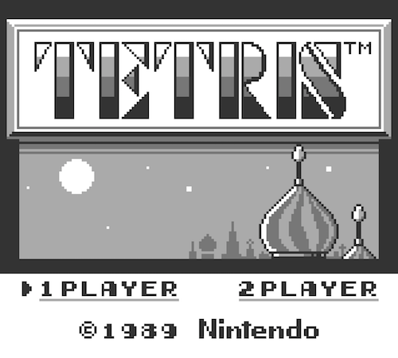
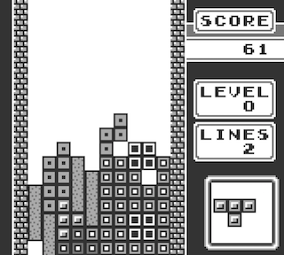

## Welcome to Tetromino

 

Tetromino is a Game Boy emulator written in Go.

### Screenshots

&nbsp;&nbsp;

### Progress so far ...

Tetromino is functional enough to play Tetris but there is still something of a todo list ...

Things that work:

* All instructions are implemented, including flags
* The fetch-execute architecture is pretty sound
* V-Blank interrupt implemented
* LCD is able to display background, window and small sprites
* The joypad and buttons are connected

Here is a sample of the todo list:

* Support for cartridge RAM
* Implement remaining LCD stuff
    * Sprite attributes
    * Large sprite support
* Implement the rest of the interrupts
    * Multiple interrupts isn't right at the moment either
* Full on validation with test ROMs
    * Use blargg tests or similar to have more confidence that it's all solid
    * Find the bugs with the current instruction implementations
* Timer support
* Sound

### Running

You'll need a ROM. I highly recommend Tetris. The main command line option is "-rom" which lets you specify the ROM filename. Run like this:

    go run cmd/tetromino/main.go -rom /roms/tetris.gb

Other options exist for enabling debug. List them like this:

    go run cmd/tetromino/main.go -help

### Common Errors

Tetris is playable but I have tested no other ROMs yet, so you'll likely see trouble there. Even Tetris probably isn't 100%. Still, it's a bit of fun, isn't it?

### Dependencies

#### Go dependencies

Install these Go dependencies:

    github.com/go-gl/gl/v2.1/gl
    github.com/go-gl/glfw/v3.1/glfw

#### GLFW dependencies

Tetromino uses [GLFW](http://www.glfw.org) for graphics so you might need to install some OS-specific packages.

> * GLFW C library source is included and built automatically as part of the Go package. But you need to make sure you have dependencies of GLFW:
> 	* On macOS, you need Xcode or Command Line Tools for Xcode (`xcode-select --install`) for required headers and libraries.
> 	* On Ubuntu/Debian-like Linux distributions, you need `libgl1-mesa-dev` and `xorg-dev` packages.
> 	* On CentOS/Fedora-like Linux distributions, you need `libX11-devel libXcursor-devel libXrandr-devel libXinerama-devel mesa-libGL-devel libXi-devel` packages.

See [this page](https://github.com/go-gl/glfw) if those instructions don't work for you.

### References and Thanks

You can find a huge amount of great information about the Game Boy out there and many people have shared their work for others to build on. Thanks to everyone who has shared their experiences, code and documentation.

These ones have been invaluable for me:
* http://marc.rawer.de/Gameboy/Docs/GBCPUman.pdf
* http://bgb.bircd.org/pandocs.htm
* http://cturt.github.io/cinoop.html
* https://github.com/fogleman/nes
* http://www.pastraiser.com/cpu/gameboy/gameboy_opcodes.html
* https://github.com/lmmendes/game-boy-opcodes
